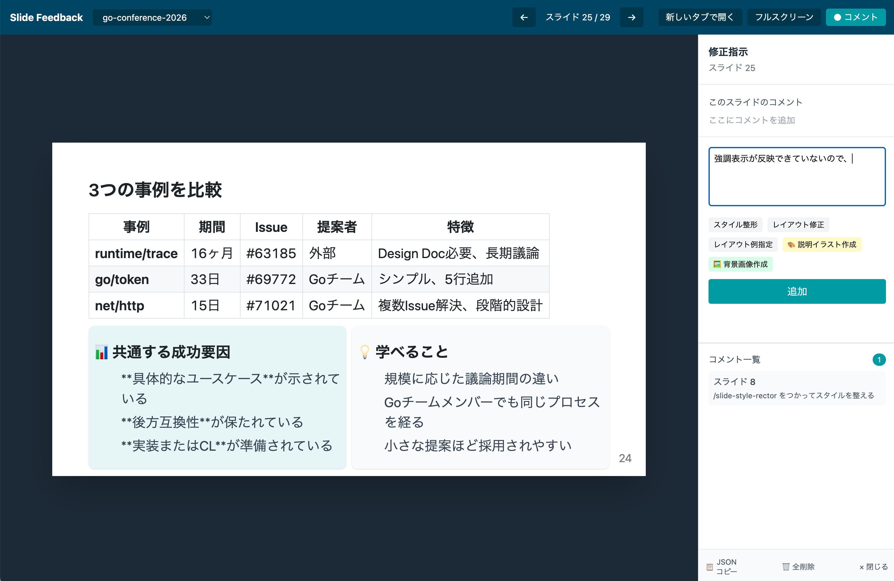

# slide-create

[AIエージェントと協働してmarpでスライドを作る2026](https://qiita.com/hirokidaichi/items/243bd176b84900f4cc0d)の記事を元に丸っとした作成をしてみました。記事で紹介されているものの方が精度が高いです。でもなんとなくは体感できると思います。

marpを使ったプレゼンテーション作成補助のためのプロジェクトです。

## セットアップ

```bash
# リポジトリをクローン
git clone <repository-url>
cd slide-create

# 依存パッケージをインストール
npm install
```

## プロジェクト構造

```
slide-create/
├── slides/           # スライドのMarkdownファイル
│   ├── example.md    # レイアウトパターン集（40種類）
│   └── */slide.md    # 各プレゼンテーション
├── themes/           # カスタムテーマ（CSS）
├── docs/             # スタイルガイド
├── tools/feedback/   # フィードバックシステム
├── scripts/          # 便利スクリプト
└── dist/             # 出力ファイル
```

## 使い方

### 新しいスライドを作成

```bash
# slidesディレクトリに新しいフォルダを作成
mkdir slides/my-presentation

# slide.mdを作成（example.mdを参考に）
```

### プレビュー

```bash
# Marpサーバーを起動（ポート3333）
./scripts/start-server.sh slides

# ブラウザで確認
open http://localhost:3333
```

## フィードバックシステム

スライドを確認しながらコメントを記録し、Claude Codeに修正を依頼できます。

```bash
# フィードバックサーバーを起動（ポート8888）
./scripts/start-feedback.sh

# ブラウザで確認
open http://localhost:8888
```

### スクリーンショット

**スライドプレビュー（Marp）**


**フィードバックUI**



### 使い方

1. スライドを1枚ずつ確認
2. 修正が必要な箇所にコメントを追加
3. 「JSONを出力」ボタンでフィードバックをコピー
4. Claude Codeに貼り付けて修正を依頼

## 出力形式

```bash
# PDF形式（発表・共有用）
npx @marp-team/marp-cli slides/*/slide.md -o output.pdf --allow-local-files

# HTML形式（Web公開用）
npx @marp-team/marp-cli slides/*/slide.md -o output.html --allow-local-files

# PowerPoint形式（編集用）
npx @marp-team/marp-cli slides/*/slide.md -o output.pptx --allow-local-files
```

## Claude Codeとの連携

このプロジェクトにはClaude Code用のスキルが含まれています。

| スキル | 説明 |
|--------|------|
| `/slide-style-rector` | スタイルガイドに基づいてレイアウトを整形 |
| `/layout-fix` | はみ出したコンテンツを収める |
| `/feedback` | フィードバックJSONを処理 |

### 使用例

```
# フィードバックを処理
{JSONをペースト}

# スタイルを整える
スライド5を /slide-style-rector で整形して
```
